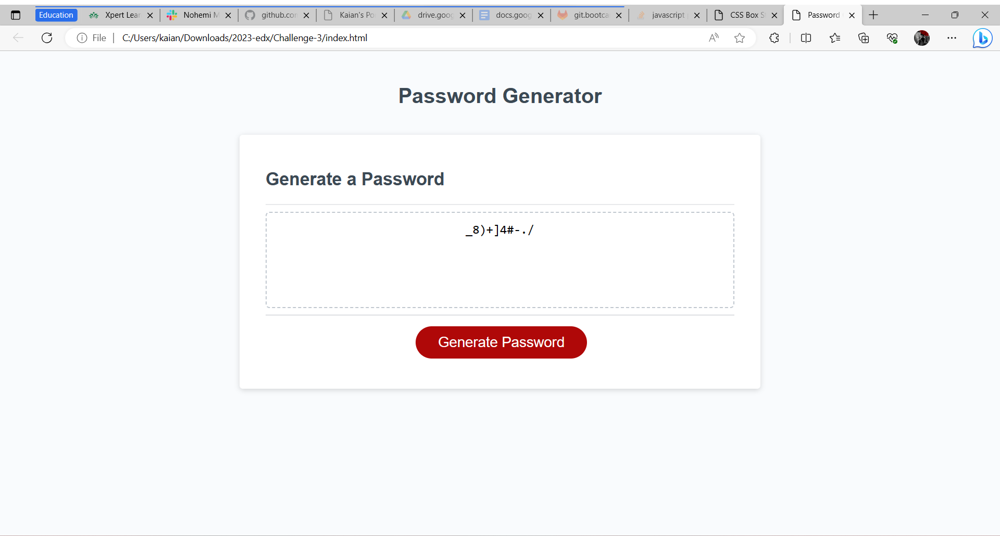

# Challenge-2

## User Story
AS AN employee with access to sensitive data
I WANT to randomly generate a password that meets certain criteria
SO THAT I can create a strong password that provides greater security

## Description
A password Generator that helps create new passwords with certain requierments.

## Usage
<ul> 
    <li> Helps create strong passwords. </li>
    <li> If needed certain characters for password , and meets certain requirements for websites.</li>
</ul>

## Deployed Site

## Screenshots

## Credited Sources
<ul>
    <li>"I received assistance from an AI Learning Assistant while working on this code."</li>
    <li>I have gotten help from insturctor @Sebastian (Alain Mena)</li>
</ul>

